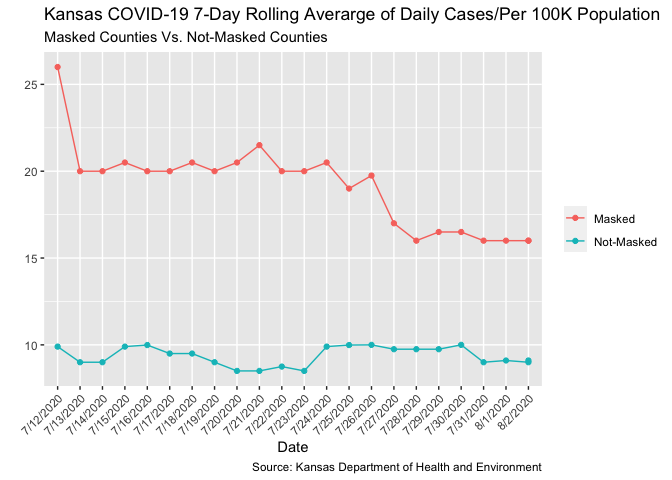

Lab 07 - Conveying the right message through visualisation
================
Conor Lacey
02-25-2023

### Load packages and data

``` r
suppressWarnings(library(tidyverse)) 
```

### Exercise 1

``` r
df <- tribble(
  ~date, ~count, ~group,
  "7/12/2020", 26, "m",
  "7/13/2020", 20, "m",
  "7/14/2020", 20, "m",
  "7/15/2020", 20.5, "m",
  "7/16/2020", 20, "m",
  "7/17/2020", 20, "m",
  "7/18/2020", 20.5, "m",
  "7/19/2020", 20, "m",
  "7/20/2020", 20.5, "m",
  "7/21/2020", 21.5, "m",
  "7/22/2020", 20, "m",
  "7/23/2020", 20, "m",
  "7/24/2020", 20.5, "m",
  "7/25/2020", 19, "m",
  "7/26/2020", 19.75, "m",
  "7/27/2020", 17, "m",
  "7/28/2020", 16, "m",
  "7/29/2020", 16.5, "m",
  "7/30/2020", 16.5, "m",
  "7/31/2020", 16, "m",
  "8/1/2020", 16, "m",
  "8/2/2020", 16, "m",
  "8/2/2020", 16, "m",
  
  "7/12/2020", 9.9, "nm",
  "7/13/2020", 9, "nm",
  "7/14/2020", 9, "nm",
  "7/15/2020", 9.9,"nm",
  "7/16/2020", 9.99, "nm",
  "7/17/2020", 9.5, "nm",
  "7/18/2020", 9.5, "nm",
  "7/19/2020", 9, "nm",
  "7/20/2020", 8.5, "nm",
  "7/21/2020", 8.5, "nm",
  "7/22/2020", 8.75, "nm",
  "7/23/2020", 8.5, "nm",
  "7/24/2020", 9.9, "nm",
  "7/25/2020", 9.99, "nm",
  "7/26/2020", 10, "nm",
  "7/27/2020", 9.75, "nm",
  "7/28/2020", 9.75, "nm",
  "7/29/2020", 9.75, "nm",
  "7/30/2020", 10, "nm",
  "7/31/2020", 9, "nm",
  "8/1/2020", 9.1, "nm",
  "8/2/2020", 9, "nm",
  "8/2/2020", 9.1, "nm",
)
head(df)
```

    ## # A tibble: 6 × 3
    ##   date      count group
    ##   <chr>     <dbl> <chr>
    ## 1 7/12/2020  26   m    
    ## 2 7/13/2020  20   m    
    ## 3 7/14/2020  20   m    
    ## 4 7/15/2020  20.5 m    
    ## 5 7/16/2020  20   m    
    ## 6 7/17/2020  20   m

### Exercise 2

``` r
df %>% ggplot(aes(x = date, y = count, color = group)) + 
  geom_point() +
  geom_line(aes(group = group)) +
  labs (title = "Kansas COVID-19 7-Day Rolling Averarge of Daily Cases/Per 100K Population",
        subtitle = "Masked Counties Vs. Not-Masked Counties",
        x = "Date",
        y = "",
        caption = "Source: Kansas Department of Health and Environment",
        color = "") + 
  scale_color_discrete(labels = c("Masked","Not-Masked"))+
  theme(axis.text.x = element_text(angle = 45, hjust=1)) 
```

<!-- -->

### Exercise 3

It is now more clear in this graph that the there are less cases overall
in not-masked counties vs. masked counties. The previous graph made it
seem as though they were relatively equal.

### Exercise 4

This graph should tells us two things. 1) Not-masked counties have less
cases overall than masked counties. 2) Wearing a mask does have a
negative effect on the number of cases. This lines up with what I know
about masking. Here’s really what I think. Masking is politically tied
where masking is associated with a more liberal population while not
masking is associated with a more conservative population. Urban areas
with dense populations typically have more liberal individuals while
rural areas with smaller populations typically have more conservative
individuals. With more people concentrated in one area the risk of
getting covid is higher and hence cases are higher in urban areas
vs. rural. As a result, I would find it interesting if we control for
population density and then looked at the effect of masking.
